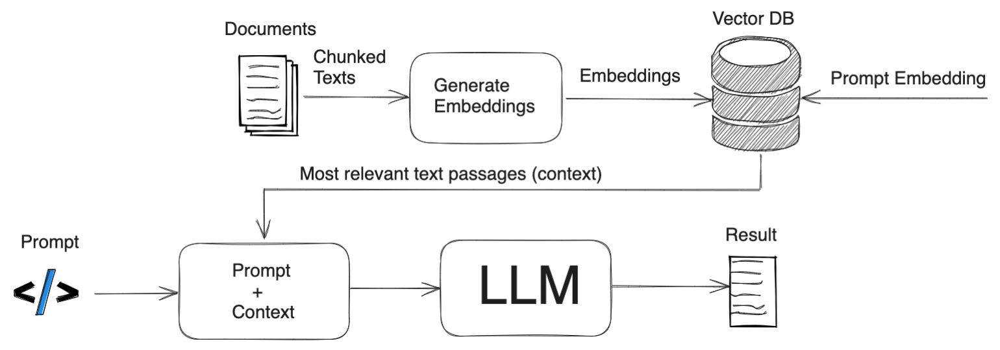

# Interact with Research Paper 

This project presents an innovative approach to enhancing the interaction with scientific papers through a blend of summarization and question-answering capabilities, leveraging the strengths of large language models (LLMs) and retrieval-augmented generation (RAG) methodologies. This project is an UI made it with Streamlit and apply embeddings models from OpenAI to read papers and ask them something related to the paper content! Explore more on the [Notebooks](./notebooks).

### System Overview

The core of the system lies in its ability to digest scientific papers, provide concise summaries, and answer queries related to the content of these papers. The workflow integrates document parsing, summary generation, embedding computation, and similarity-based retrieval to create a responsive and informative user interface.


**This streamlit app is ready to deploy.**

## Features:
1. Paper Upload either Pdf or Arxiv paper link
2. Summarize the paper with OpenAI model. You can also use hugging face model for summarization. See this [notebook](notebooks/articlesummarizerhuggingface.ipynb).
3. Interact with paper as asking question. This works as follows:
   1. Get the chunks of text and calculate embeddings of each. 
      1. **In Inference:**
         1. New Question -> Calculate embedding 
         2. Get topK similar chunks through cosine similarity.

    
## Architecture


Here's a detailed breakdown and elaboration on how this system operates, highlighting its components and the technologies it utilizes:

### Workflow Description

#### 1. Document Upload and Summary Generation

- **Input**: Users can input a document either by uploading a PDF file or providing an ArXiv link.
- **Summary Generation**: The system processes the text to generate a summary using OpenAI's `text-davinci-003` model. This summary serves two purposes:
  - It provides a quick overview of the document for the user.
  - It acts as a source for generating embeddings that represent the document's content.

#### 2. Embedding Generation and Storage

- **Embedding Generation**: For each section of the summarized text, embeddings are generated using the `text-embedding-ada-002` model. These embeddings are vector representations that capture the semantic essence of the text.
- **Storage**: The generated embeddings are stored alongside the original text segments, facilitating the retrieval of relevant content based on similarity to query embeddings.

#### 3. Query Processing and Response Generation

- **User Query**: When a user inputs a query related to the paper, the system first converts this query into an embedding using the same model (`text-embedding-ada-002`) to ensure compatibility.
- **Similarity Computation and Retrieval**: The system computes cosine similarity between the query embedding and all document segment embeddings stored previously. It then retrieves the segments with the highest similarity scores.
- **Response Generation**: The most relevant text segments are presented to users as responses to their query. This process mimics a retrieval-augmented generation approach, where the LLM leverages external information (in this case, segments of the document) to generate responses.

### Technologies and Models Used

- **OpenAI LLMs**: The project utilizes models from OpenAI for both summary generation (`text-davinci-003`) and embedding generation (`text-embedding-ada-002`). These models are at the forefront of natural language processing, providing state-of-the-art performance in understanding and generating human-like text. You can fine-tune the available open model for your use cases.
- **Retrieval-Augmented Generation (RAG)**: Although not explicitly mentioned as a distinct component, the process of embedding generation, storage, and retrieval based on query similarity embodies the principles of RAG. By leveraging stored knowledge (document embeddings) to augment the generation of responses, the system enhances the relevance and accuracy of the information it provides in response to user queries.


## Usage 🔩
1. Install requirements
```
pip install -r requirements.txt
```
2. Create a .env file with the apikey from OPENAI, with the following content
```
OPENAI_API_KEY
```

3. Run the app
```
streamlit run main.py
```

### Demo:


